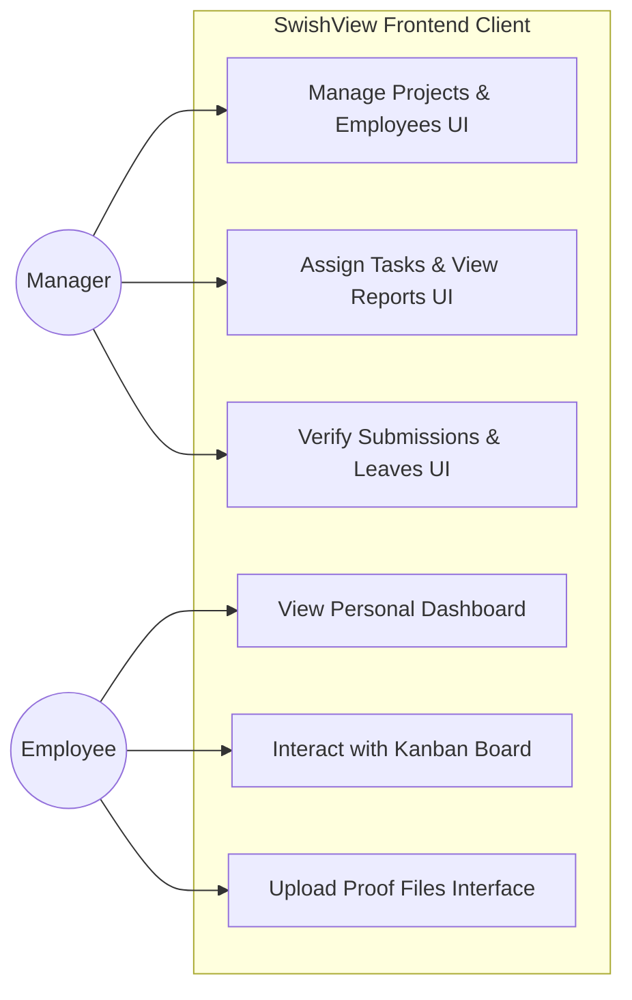
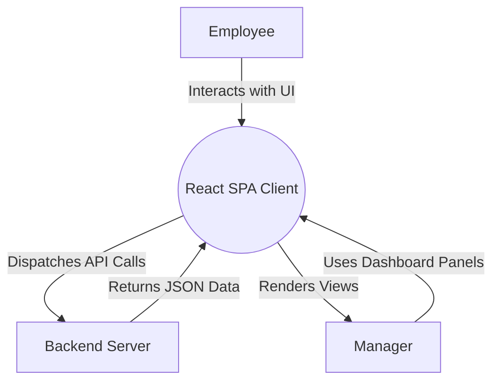
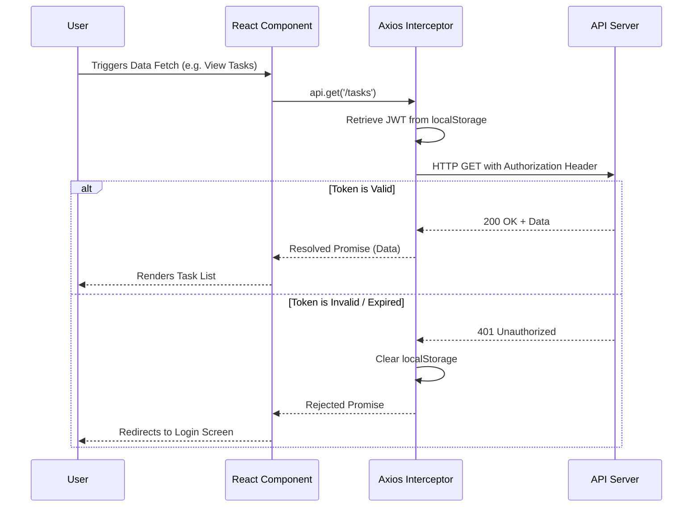

<div align="center">

# SwishView WorkHub: Managing Enterprise Teams with Efficiency

Internship Project Report submitted in partial fulfillment of the requirement for the degree of

**B.Tech**  
in  
**Computer Science & Engineering**

<br/><br/>

Developed during a Frontend Developer Internship at  
**Swish View**  
*(12 June, 2026 to 20 July, 2026)*

<br/><br/>

**Bhagwan Parshuram Institute of Technology**  
*(Placeholder for Institute Logo)*

<br/><br/>

by

**Aditya Tiwari**  
**Enrollment No: 02520802724**  
**Class: CSE-A**

<br/><br/>

**Department of Computer Science & Engineering**  
Bhagwan Parshuram Institute of Technology  
PSP-4, Sec-17, Rohini, Delhi-89

**September 2026**

</div>

<div style="page-break-after: always;"></div>

<div align="center">

## DECLARATION

</div>

This is to certify that the Report titled "SwishView WorkHub: Managing Enterprise Teams with Efficiency", is submitted by me in partial fulfillment of the requirement for the award of degree of B.Tech in Computer Science & Engineering to Bhagwan Parshuram Institute of Technology (BPIT), Rohini, Delhi, affiliated to Guru Gobind Singh Indraprastha University, Delhi. It comprises of my original work, carried out as part of my Summer Training / Internship at Swish View. Due acknowledgement has been made in the report for using the work of others.

Date: 30/7/2026  
Place: Delhi

<p align="right">
<b>Aditya Tiwari</b><br/>
Enrollment No: 02520802724<br/>
Class: CSE-A<br/>
Signature: ______________________
</p>

<div style="page-break-after: always;"></div>

<div align="center">

## COMPANY CERTIFICATE

</div>

<br/>

<br/>

<div style="page-break-after: always;"></div>

<div align="center">

## TRAINING COORDINATOR CERTIFICATE

</div>

This is to certify that the Report titled "SwishView WorkHub: Managing Enterprise Teams with Efficiency" is submitted by Aditya Tiwari (02520802724), under the guidance of Swish View, in partial fulfillment of the requirement for the award of the degree of B.Tech in Computer Science & Engineering to BPIT Rohini affiliated to GGSIP University, Delhi. The matter embodied in this Report is original and has been duly approved for the submission.

<br/><br/>
(Signature)  
Date: 30/7/2026

<div style="page-break-after: always;"></div>

<div align="center">

## ACKNOWLEDGEMENT

</div>

I would like to express my deepest appreciation to all those who provided me the possibility to complete this report. A special gratitude I give to our Training Coordinator, whose contribution in stimulating suggestions and encouragement, helped me to coordinate my project especially in writing this report.

I would also like to acknowledge with much appreciation the crucial role of the staff of Bhagwan Parshuram Institute of Technology, who gave the permission to use all required equipment and the necessary materials to complete the task.

Furthermore, I would like to extend my deepest gratitude to **Mr. Aman Kumar, Founder & CEO of Swish View**, for granting me the opportunity to work as a Frontend Developer Intern. The professional guidance and enterprise-level problem statements provided by Swish View were instrumental in the successful development of this project. Finally, I acknowledge my teammate **Pranav Kumar** for his significant contributions to the backend development.

<br/><br/><br/>
<p align="right">
(Signature of the student with Date)
</p>

<div style="page-break-after: always;"></div>

<div align="center">

## TABLE OF CONTENTS

</div>

DECLARATION ........................................................................................................................ 2  
COMPANY CERTIFICATE ................................................................................................. 3  
TRAINING COORDINATOR CERTIFICATE ................................................................ 4  
ACKNOWLEDGEMENT ........................................................................................................ 5  
ABSTRACT .............................................................................................................................. 7  
CHAPTER 1: INTRODUCTION ............................................................................................. 8  
CHAPTER 2: LITERATURE REVIEW ................................................................................. 11  
CHAPTER 3: PROBLEM STATEMENT & OBJECTIVES ................................................ 15  
CHAPTER 4: SYSTEM ANALYSIS AND DESIGN ............................................................ 17  
CHAPTER 5: METHODOLOGY & IMPLEMENTATION ............................................... 20  
CHAPTER 6: SOFTWARE TESTING ................................................................................. 23  
CHAPTER 7: RESULTS & SCREENSHOTS ....................................................................... 25  
CHAPTER 8: CONCLUSION & FUTURE WORK ........................................................... 30  
REFERENCES ........................................................................................................................ 32  
APPENDIX A: FRONTEND SOURCE CODE ................................................................... 33  

<div style="page-break-after: always;"></div>

<div align="center">

## LIST OF FIGURES

</div>

Fig 4.1 System Use Case Diagram  
Fig 4.2 Data Flow Diagram (Level 0)  
Fig 4.3 Sequence Diagram: JWT Authentication  
Fig 7.1 Manager Dashboard Overview  
Fig 7.2 Manager Employee Directory  
Fig 7.3 Manager Task Verification Kanban  
Fig 7.4 Manager Attendance & Leave Portal  
Fig 7.5 Manager Reports & Analytics Engine  
Fig 7.6 Unified Login & Registration Interface (Employee)  
Fig 7.7 Employee Dashboard & Analytics  
Fig 7.8 Employee Task Kanban Board & AI Recommendations  
Fig 7.9 Employee Attendance & Leave Management Portal  

<br/><br/><br/>

<div align="center">

## LIST OF TABLES

</div>

Table 4.1 Hardware Requirements  
Table 4.2 Software Requirements & Tech Stack  

<div style="page-break-after: always;"></div>

<div align="center">

## ABSTRACT

</div>

SwishView WorkHub is a comprehensive Enterprise Team and Project Management System designed to bridge the digital gap between managers, employees, and cross-functional teams. In modern corporate environments, tracking daily operations such as project progression, task assignments, and verified file submissions often relies on fragmented systems or informal communication channels. This fragmentation leads to data inconsistency, communication delays, and severe security vulnerabilities regarding confidential file sharing. This project introduces a centralized, unified web application that streamlines these complex corporate processes into a single, highly intuitive platform.

The frontend of the system is built using a modern Single Page Application (SPA) approach, featuring React.js (via Vite) and TailwindCSS for a highly responsive and aesthetic user interface. Client-side routing allows for seamless navigation, and secure state management ensures that JSON Web Tokens (JWT) are handled safely for stateless authentication and Role-Based Access Control (RBAC).

SwishView WorkHub features heavily secured and dynamic user interfaces. The Manager view provides capabilities for managing projects, onboarding team members, and verifying task submissions. The Employee dashboard serves as a personalized hub where staff can track their pending workloads, update task statuses, and securely upload deliverables. By digitizing and unifying these workflows into an intuitive frontend client, SwishView WorkHub significantly reduces administrative overhead and fosters an efficient corporate ecosystem.

<div style="page-break-after: always;"></div>

<div align="center">

## CHAPTER 1: INTRODUCTION

</div>

### 1.1 Background of the Study
The rapid globalization of business operations has necessitated a radical shift in how corporate entities manage their human capital and operational tasks. Traditionally, project management was a localized effort, requiring physical meetings, paper-based reporting, and localized network storage for file deliverables. With the advent of the digital age, these processes moved online. However, early digital solutions were highly fragmented. Human Resources departments utilized specific software for onboarding and team hierarchy management, while operational managers utilized separate software for task tracking (e.g., Kanban boards).

This fragmentation creates a massive bottleneck. When an employee completes a task, they must update the task-tracking software, navigate to a separate file-hosting service to upload the proof of work, and subsequently notify their manager via a third communication platform. SwishView WorkHub was born out of the necessity to eliminate this inefficiency.

### 1.2 Project Overview
SwishView WorkHub is an integrated, web-based platform designed specifically to manage the core operational workflows of a corporate team without the unnecessary bloat of heavy enterprise systems. It provides tailored, secure experiences for two distinct types of users: Managers and Employees.

By bringing everything under one digital roof, the institution benefits from a "Single Source of Truth." When an employee uploads a proof-of-work document, the manager sees the updated status and secure file link on their dashboard instantly through a seamless React frontend.

### 1.3 Motivation
The motivation for this project stems from three primary observations within standard corporate environments: 
1. **Usability Issues:** Existing project management software is often visually outdated or overly complex to use on modern web browsers, requiring extensive onboarding training for new employees.
2. **Disjointed Systems:** Critical data such as task status and verified file submissions are frequently managed across disjointed systems.
3. **Security Vulnerabilities:** There is a distinct lack of security in MVP-stage applications regarding static file hosting. SwishView WorkHub was designed to address all three of these gaps within a single, cohesive application built on modern frontend web frameworks.

### 1.4 Scope of the Project
The scope of the frontend aspect of SwishView WorkHub covers the following capabilities:
* **Authentication UI & Security:** Secure login screens, persistent local session handling, and UI-level authorization ensuring employees cannot access managerial controls.
* **Administrative Control Panels:** Complete interfaces for managing projects, creating teams, and assigning specific tasks to employees.
* **Interactive Task Lifecycle Management:** Drag-and-drop tools for employees to dynamically move tasks across a Kanban-style board (Pending, In Progress, Review, Completed).
* **File Submission Interfaces:** A highly intuitive module allowing employees to seamlessly upload assignment files (PDFs, Images) for managerial review.

<div style="page-break-after: always;"></div>

<div align="center">

## CHAPTER 2: LITERATURE REVIEW

</div>

### 2.1 Evolution of Project Management Systems
The history of project management software is deeply tied to the evolution of software engineering methodologies. Early systems in the 1990s were designed around the Waterfall model, featuring rigid Gantt charts and strictly gated workflows. Examples include early versions of Microsoft Project. While powerful, these tools lacked agility and were primarily used by dedicated Project Managers rather than the operational workforce.

The Agile manifesto in the early 2000s spurred the development of issue-tracking software like Atlassian's Jira. Jira popularized the digital Kanban board, allowing individual developers to pull tasks across columns (To Do, In Progress, Done). Simultaneously, tools like Trello brought this Kanban approach to a broader, non-technical audience by prioritizing ease of use over complex configuration. SwishView WorkHub attempts to build upon this by enforcing secure file submissions directly onto the task cards through an interactive UI, forcing verification before completion.

### 2.2 Modern Web Architecture: SPA vs MPA
Historically, web applications were Multi-Page Applications (MPAs). Every interaction required the browser to request a completely new HTML page from the server, resulting in slow load times and a poor user experience. 

The advent of JavaScript frameworks like AngularJS and subsequently React.js revolutionized this paradigm by introducing Single Page Applications (SPAs). In an SPA, the browser loads a single HTML document and a large JavaScript bundle. Subsequent navigation and data fetching occur asynchronously via AJAX/Fetch APIs. The SwishView WorkHub utilizes React.js precisely for this reason. By utilizing React's Virtual DOM, the application only re-renders the specific components that have changed (e.g., moving a task card from "Pending" to "In Progress"), resulting in instantaneous feedback.

### 2.3 Token-Based Authentication in Frontend Applications
Prior to the widespread adoption of RESTful APIs, web security was primarily managed via server-side sessions and browser cookies. JSON Web Tokens (JWT) solve scaling issues by offloading the session state to the client. The frontend stores this token (e.g., in `localStorage` or `sessionStorage`) and transmits it via the `Authorization: Bearer <token>` HTTP header for all subsequent API calls. The SwishView WorkHub frontend client utilizes Axios interceptors to seamlessly handle this token injection, ensuring a smooth and secure user experience without constant re-authentication.

<div style="page-break-after: always;"></div>

<div align="center">

## CHAPTER 3: PROBLEM STATEMENT & OBJECTIVES

</div>

### 3.1 Problem Statement
Managers and employees navigating daily corporate operations face deeply interconnected logistical problems. First, authoritative, structured information regarding project standing is highly fragmented. An employee may need to visit a ticketing portal to see their assignments, and rely on informal group chats or emails to submit the actual files. Second, the sheer volume of manual verification forced upon managers leads to high rates of error and significantly reduces the time managers can dedicate to actual leadership.

Existing solutions either involve deploying massive, expensive ERP software suites that require extensive training to use, or relying on a patchwork of consumer-grade tools which compromises data privacy and institutional control. There is an urgent need for a custom-built, unified system that combines the administrative rigor of an ERP with the sleek, user-friendly interface of a modern web application.

### 3.2 Objectives
The specific objectives of the frontend development phase of this project are as follows:

1. **To develop a highly responsive, modern user interface** using React.js and TailwindCSS that works seamlessly across desktop and laptop screens without the slow page reloads associated with legacy systems.
2. **To implement Role-Based UI Access Control (RBAC)** that strictly enforces security boundaries and personalized dashboard views between Managers and Employees.
3. **To design intuitive Task Management Modules**, including interactive Kanban boards that allow employees to visually track and update task progress.
4. **To automate and secure the task submission lifecycle on the client side**, providing seamless upload interfaces for PDF and Image deliverables.
5. **To ensure a premium aesthetic (UI/UX)** through smooth transitions, modern typography, and immediate visual feedback using state management techniques.

<div style="page-break-after: always;"></div>

<div align="center">

## CHAPTER 4: SYSTEM ANALYSIS AND DESIGN

</div>

### 4.1 Software Requirement Specification
This section outlines the hardware and software requirements necessary to run and deploy the frontend of SwishView WorkHub effectively.

*4.1.1 Hardware Requirements (Client)*

| Component | Minimum Requirement | Recommended for Scale |
| :--- | :--- | :--- |
| Processor | Dual-core CPU, 2.0 GHz or higher | Quad-core CPU, 3.0+ GHz |
| RAM | 4 GB | 8 GB+ |
| Browser | Modern Web Browser (Chrome, Edge) | Latest Chromium-based browser |
| Network | Standard broadband connection | High-bandwidth connection |

**Table 4.1: Hardware Requirements**

*4.1.2 Technology Stack (Frontend)*

| Layer | Technology | Version Used |
| :--- | :--- | :--- |
| Frontend UI Framework | React.js (via Vite) | 18.x |
| Frontend Styling | TailwindCSS | 3.x |
| HTTP Client | Axios | Latest |
| Routing | React Router DOM | 6.x |

**Table 4.2: Software Requirements & Tech Stack**

### 4.2 System Diagrams

#### 4.2.1 Use Case Diagram
The system features two distinct actors—the Manager (Administrator) and the Employee. The use case diagram illustrates the exclusive actions permitted for each actor through the user interface.


<div align="center"><i>Fig 4.1 System Use Case Diagram</i></div>

#### 4.2.2 Data Flow Diagram (Level 0 Context)
The Level 0 Data Flow Diagram illustrates the high-level flow of information between the external entities and the frontend client interface, leading to the API.


<div align="center"><i>Fig 4.2 Data Flow Diagram (Level 0)</i></div>

#### 4.2.3 Sequence Diagram: Frontend JWT Authentication Handling
This sequence diagram details how the frontend client intercepts requests and manages the JWT session when interfacing with the backend.


<div align="center"><i>Fig 4.3 Sequence Diagram: JWT Authentication</i></div>

<div style="page-break-after: always;"></div>

<div align="center">

## CHAPTER 5: METHODOLOGY & IMPLEMENTATION

</div>

The frontend was implemented as a decoupled Single Page Application (SPA), communicating exclusively with the backend via RESTful HTTP requests using Axios. This chapter describes the methodology followed for the frontend development.

### 5.1 Project File Structure
To maintain a clean separation of concerns, the frontend codebase is modularized within the `/frontend` directory using Vite.

* **`/src/components`**: Reusable UI elements (Buttons, Modals, Cards).
* **`/src/pages`**: Full-page layout views (Dashboard, Tasks, Login).
* **`/src/services`**: API and HTTP interceptor configurations.
* **`/src/layouts`**: Structural wrapper components ensuring consistent navigation headers and sidebars.

### 5.2 Frontend Implementation (React, TailwindCSS)
The frontend was bootstrapped using Vite, which provides significantly faster Hot Module Replacement (HMR) during development compared to standard Create React App (CRA). The interface utilizes React Router for client-side routing, ensuring instantaneous navigation without full page reloads.

#### 5.2.1 Component Architecture and State Management
React's functional components and Hooks (e.g., `useState`, `useEffect`) were utilized extensively. Complex dashboards were broken down into smaller, highly cohesive components. For example, the Tasks page aggregates a `KanbanColumn` component, which in turn renders `TaskCard` components. This hierarchical state management ensures predictable data flow.

#### 5.2.2 API Interceptors and Session Management
To interface with the secured backend smoothly, an Axios interceptor was engineered. This interceptor intercepts every outgoing HTTP request from the React application and automatically injects the stored JWT into the headers.

```javascript
// Example Interceptor Logic
api.interceptors.request.use(
  (config) => {
    const token = localStorage.getItem('token');
    if (token) config.headers.Authorization = `Bearer ${token}`;
    return config;
  }
);
```
If the backend returns a 401 Unauthorized (indicating an expired token), the interceptor catches the response and immediately redirects the user to the login screen, effectively clearing the invalid session and maintaining UI security.

#### 5.2.3 UI/UX Aesthetics
Aesthetics were a primary focus for this project. TailwindCSS was used extensively to create a modern, clean interface without the need to write thousands of lines of custom CSS. Soft grays, vibrant accent colors (greens for completed tasks, blues for active items), and subtle hover animations give the application a premium feel that starkly contrasts with legacy ERP systems. Modals and overlays were implemented using React state to prevent jarring page transitions when an employee wants to upload a file or update a status.

<div style="page-break-after: always;"></div>

<div align="center">

## CHAPTER 6: SOFTWARE TESTING

</div>

Testing is a critical phase of the software development lifecycle, ensuring that the frontend functions correctly, securely, and intuitively before deployment.

### 6.1 Unit Testing and Component Rendering
Isolated React components (such as the generic Modal wrapper, interactive Buttons, and layout components) were tested manually and structurally to ensure they render correctly given specific props, without needing the entire application context to load. Conditional rendering was verified to ensure that Admin panels are completely hidden from standard Employee accounts.

### 6.2 API Integration Testing
Integration testing ensures that the React frontend correctly parses and displays the data provided by the backend APIs.
* **Interceptor Verification:** Verified that the Axios interceptor correctly attaches the JWT to the authorization header on every outgoing request.
* **Error Handling:** Tested how the UI responds to server errors (e.g., 500 Internal Server Error, 403 Forbidden). Verified that appropriate toast notifications or fallback UI components are rendered to inform the user gracefully instead of breaking the application.

### 6.3 User Acceptance Testing (UAT)
User Acceptance Testing involves testing the software from the perspective of the end-user to ensure the UI/UX is intuitive.
* **Task Workflow Test:** An end-to-end test was performed simulating an employee logging in, viewing their Kanban board, dragging a task from "Pending" to "In Progress", interacting with the file upload modal, and marking the task as "Review". The test confirmed the React state updated instantly and the UI provided correct visual feedback.
* **Responsiveness Test:** The application was tested across different screen resolutions to ensure the TailwindCSS utility classes successfully adapted the grid layouts for smaller screens and laptops.

<div style="page-break-after: always;"></div>

<div align="center">

## CHAPTER 7: RESULTS & SCREENSHOTS

</div>

The implementation of the SwishView WorkHub frontend yielded a fully functional, highly aesthetic web application. The React client successfully segregates users, dynamically renders appropriate dashboards, and provides a premium user experience. Below are the resulting interfaces for the various modules developed.

---

### 7.1 Manager Portal Interfaces

#### 7.1.1 Manager Dashboard Overview
The Manager Dashboard serves as the command center for administrative users. It provides a real-time statistical overview of the organization. The interface prominently features an "Urgent Deadlines" panel to ensure managers can address blocking issues rapidly. The top navigation bar grants exclusive access to managerial functions.

<br/><br/><br/><br/>

<br/><br/><br/><br/>
<div align="center"><i>Fig 7.1 Manager Dashboard Overview</i></div>
<br/>

#### 7.1.2 Employee Directory Management
The Employees portal displays a clean, tabular view of staff members, their respective departments, designations, and active status. The UI includes an intuitive search bar and an "+ Add Employee" modal integration.

<br/><br/><br/><br/>

<br/><br/><br/><br/>
<div align="center"><i>Fig 7.2 Manager Employee Directory</i></div>
<br/>

#### 7.1.3 Task Assignment & Verification Kanban
The Manager's view of the Task Kanban board provides oversight of all ongoing work. Tasks in the "In Review" column surface a "Verify Submission" UI element explicitly for managers.

<br/><br/><br/><br/>

<br/><br/><br/><br/>
<div align="center"><i>Fig 7.3 Manager Task Verification Kanban</i></div>
<br/>

#### 7.1.4 Institutional Attendance & Leave Approval
The Manager's Attendance interface provides a Daily Roll Call list. The interface features "Quick Actions" buttons allowing fast state changes. 

<br/><br/><br/><br/>

<br/><br/><br/><br/>
<div align="center"><i>Fig 7.4 Manager Attendance & Leave Portal</i></div>
<br/>

#### 7.1.5 Reporting & Analytics Engine
The Reports portal provides a flexible query builder interface where managers can define filters.

<br/><br/><br/><br/>

<br/><br/><br/><br/>
<div align="center"><i>Fig 7.5 Manager Reports & Analytics Engine</i></div>

<div style="page-break-after: always;"></div>

---

### 7.2 Employee Portal Interfaces

#### 7.2.1 Unified Login & Registration Interface
The login and registration interface features a sleek, split-pane design using soft green gradients. It intelligently provides visual feedback and dynamically adapts based on the user's role selection.

<br/><br/><br/><br/>

<br/><br/><br/><br/>
<div align="center"><i>Fig 7.6 Unified Login & Registration Interface (Employee)</i></div>
<br/>

#### 7.2.2 Employee Personal Dashboard & Analytics
The Employee Dashboard provides a high-level statistical overview of the user's personal workload. 

<br/><br/><br/><br/>

<br/><br/><br/><br/>
<div align="center"><i>Fig 7.7 Employee Dashboard & Analytics</i></div>
<br/>

#### 7.2.3 Interactive Task Kanban Board
The Employee Task module demonstrates a modern, interactive Kanban board where staff can organize their specific assignments. A standout UI feature is the **AI Task Recommendations** banner. 

<br/><br/><br/><br/>

<br/><br/><br/><br/>
<div align="center"><i>Fig 7.8 Employee Task Kanban Board & AI Recommendations</i></div>
<br/>

#### 7.2.4 Personal Attendance & Leave Tracking
The Employee Attendance module incorporates modern data visualization techniques, heavily inspired by GitHub's contribution graph UI.

<br/><br/><br/><br/>

<br/><br/><br/><br/>
<div align="center"><i>Fig 7.9 Employee Attendance & Leave Management Portal</i></div>

<div style="page-break-after: always;"></div>

<div align="center">

## CHAPTER 8: CONCLUSION & FUTURE WORK

</div>

### 8.1 Conclusion
This project set out to address the fragmented, outdated, and overly complex nature of existing corporate management systems by building the frontend for SwishView WorkHub, a unified, highly aesthetic web application. By utilizing a robust frontend stack (React/Vite) and TailwindCSS, the system produces an exceptionally fast, responsive, and reliable user experience.

The strict implementation of client-side routing and interceptors effectively secures the two distinct UI portals—Manager and Employee—ensuring data privacy and preventing unauthorized access at the presentation layer. 

Ultimately, the frontend of SwishView WorkHub successfully demonstrates how modern web development paradigms and thoughtful UI/UX design can drastically improve the operational efficiency of an enterprise, providing an intuitive interface that is a pleasure to use.

### 8.2 Limitations
* **Real-time Updates:** Notifications and task status updates currently rely on RESTful fetching and require the user to refresh or interact with the page; they are not pushed to the client in true real-time.
* **Complex Data Grids:** Extremely large datasets (e.g., thousands of employees) may require more advanced virtualization techniques in the UI to maintain 60FPS scrolling performance.

### 8.3 Future Work
* **WebSockets for Real-time UI:** Implement WebSocket listeners in the React application to facilitate live, instant messaging between employees and managers, and to push real-time alerts when a task status changes on the Kanban board.
* **Mobile Application:** Port the React.js components into React Native to provide native iOS and Android applications, allowing employees to access their dashboards natively on smartphones.
* **Advanced Theming:** Introduce a robust light/dark mode toggle and customizable theme accents using Tailwind CSS variables.

<div style="page-break-after: always;"></div>

<div align="center">

## REFERENCES

</div>

[1] Meta Platforms, Inc.; React Documentation; https://react.dev/ (accessed 2026).

[2] Tailwind Labs; Tailwind CSS Documentation; https://tailwindcss.com/docs (accessed 2026).

[3] Vite Core Team; Vite: Next Generation Frontend Tooling; https://vitejs.dev/guide/ (accessed 2026).

[4] Axios Contributors; Axios Promise based HTTP client; https://axios-http.com/docs/intro (accessed 2026).

[5] Mermaid.js Contributors; Mermaid Documentation; https://mermaid.js.org/ (accessed 2026).

<div style="page-break-after: always;"></div>

<div align="center">

## APPENDIX A: FRONTEND SOURCE CODE

</div>

This appendix contains the core React components that dictate the routing, API interception, and dynamic user interface.

### A.1 api.js (Axios Interceptor)
```javascript
import axios from 'axios';

const API_BASE_URL = 'http://localhost:8080/api';

const api = axios.create({
  baseURL: API_BASE_URL,
});

api.interceptors.request.use(
  (config) => {
    const token = localStorage.getItem('token');
    if (token) {
      config.headers.Authorization = `Bearer ${token}`;
    }
    return config;
  },
  (error) => {
    return Promise.reject(error);
  }
);

api.interceptors.response.use(
  (response) => response,
  (error) => {
    if (error.response && error.response.status === 401) {
      localStorage.removeItem('token');
      localStorage.removeItem('role');
      window.location.href = '/login';
    }
    return Promise.reject(error);
  }
);

export default api;
```

### A.2 App.jsx (React Router Setup)
```javascript
import React from 'react';
import { BrowserRouter, Routes, Route, Navigate } from 'react-router-dom';
import MainLayout from './layouts/MainLayout';
import Dashboard from './pages/Dashboard';
import Login from './pages/Login';
import Signup from './pages/Signup';
import Projects from './pages/Projects';
import Tasks from './pages/Tasks';

function PrivateRoute({ children }) {
  const isAuthenticated = localStorage.getItem('token') !== null;
  return isAuthenticated ? children : <Navigate to="/login" />;
}

function App() {
  return (
    <BrowserRouter>
      <Routes>
        <Route path="/login" element={<Login />} />
        <Route path="/signup" element={<Signup />} />
        
        <Route path="/" element={<PrivateRoute><MainLayout /></PrivateRoute>}>
          <Route index element={<Navigate to="/dashboard" replace />} />
          <Route path="dashboard" element={<Dashboard />} />
          <Route path="projects" element={<Projects />} />
          <Route path="tasks" element={<Tasks />} />
        </Route>
      </Routes>
    </BrowserRouter>
  );
}

export default App;
```

### A.3 Tasks.jsx (Partial Kanban Board Logic)
```javascript
import React, { useState, useEffect } from 'react';
import api from '../services/api';
// ... imports

const Tasks = () => {
    const [tasks, setTasks] = useState([]);
    const [loading, setLoading] = useState(true);

    useEffect(() => {
        fetchTasks();
    }, []);

    const fetchTasks = async () => {
        try {
            const res = await api.get('/tasks');
            setTasks(res.data);
            setLoading(false);
        } catch (err) {
            console.error(err);
            setLoading(false);
        }
    };

    const handleStatusChange = async (taskId, newStatus) => {
        try {
            await api.put(`/tasks/${taskId}`, { status: newStatus });
            fetchTasks(); // Refresh board
        } catch (err) {
            console.error("Failed to update status");
        }
    };

    // Render logic omitted for brevity...
};

export default Tasks;
```
