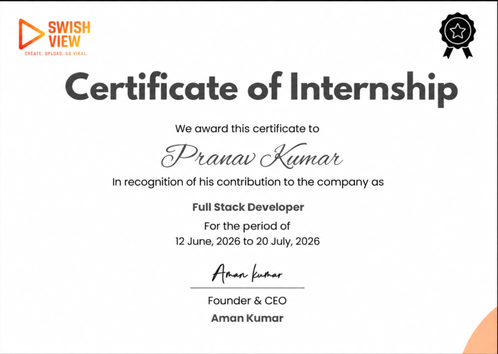
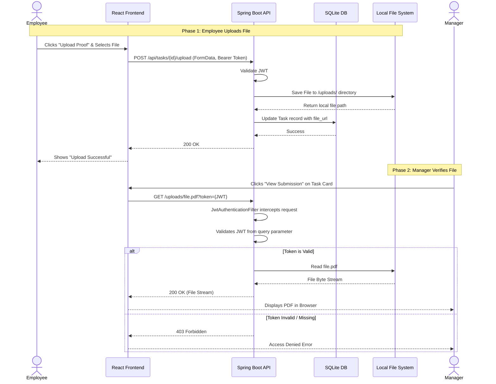
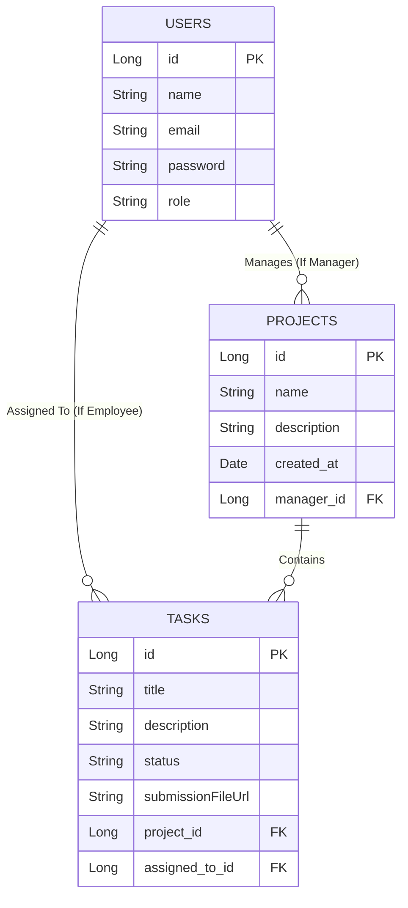
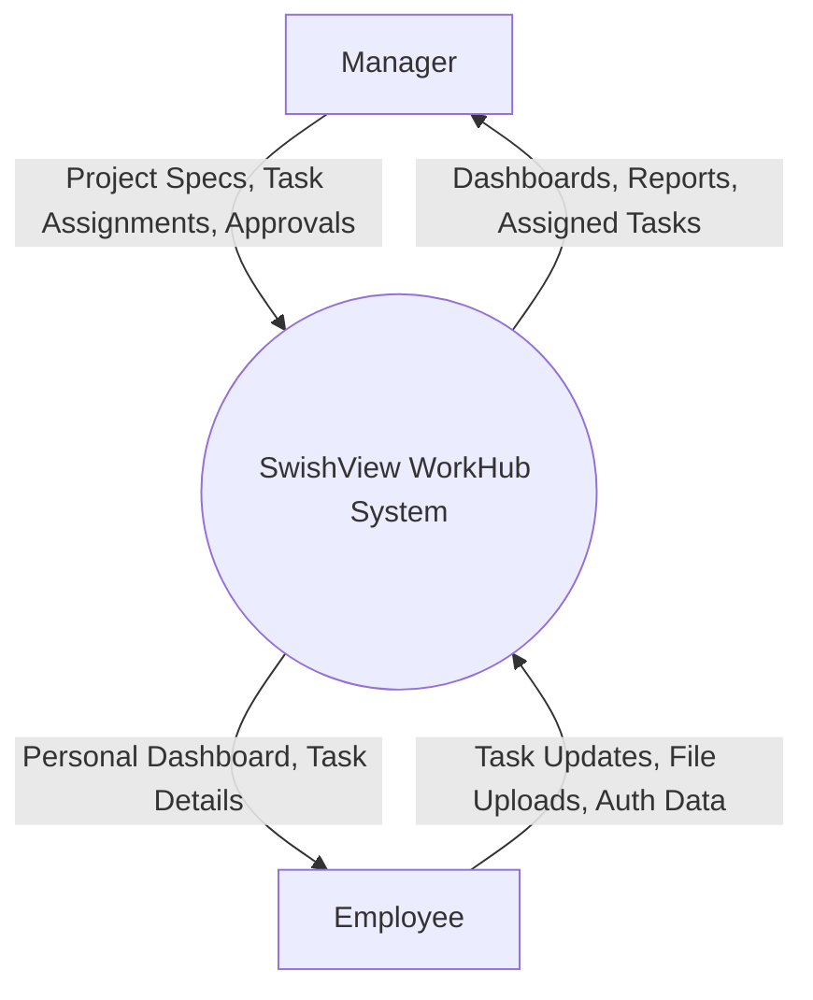
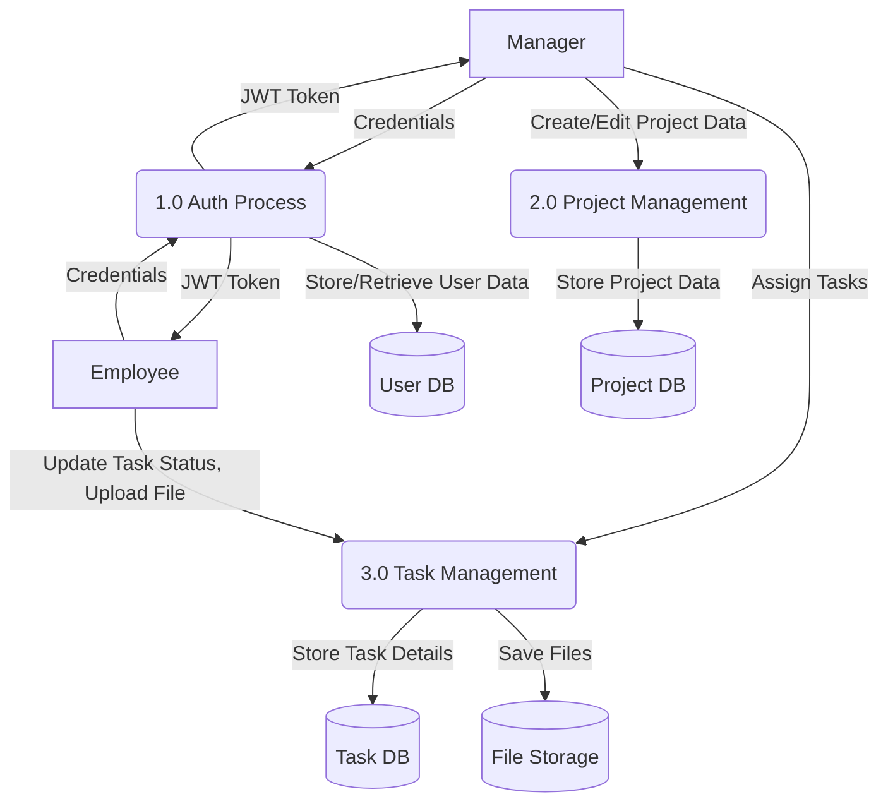

<div align="center">

# SwishView WorkHub: An Enterprise Team & Project Management System

Report submitted in partial fulfillment of the requirement for the degree of

**B.Tech**  
in  
**Computer Science & Engineering**

by

**Pranav Kumar** (Enrollment No: 01920802724)  
**Aditya Tiwari** (Enrollment No: 02520802724)  
**Class:** CSE-A


**Department of Computer Science & Engineering**  
**Bhagwan Parshuram Institute of Technology**  
PSP-4, Sec-17, Rohini, Delhi-89

**September 2026**

</div>

---

<div style="page-break-after: always;"></div>

## DECLARATION

This is to certify that the Report titled **"SwishView WorkHub: An Enterprise Team & Project Management System"**, is submitted by us in partial fulfillment of the requirement for the award of degree of B.Tech in Computer Science & Engineering to Bhagwan Parshuram Institute of Technology (BPIT), Rohini, Delhi, affiliated to Guru Gobind Singh Indraprastha University, Delhi. It comprises of the original work carried out under our respective roles: myself, **Pranav Kumar**, acting as the **Fullstack Developer** and architect of the system, and **Aditya Tiwari**, acting as the **Frontend Developer**. Due acknowledgement has been made in the report for using the work of others.

**Date:** September 2026  
**Place:** Delhi  

Pranav Kumar (01920802724)  
Aditya Tiwari (02520802724)  
**Class:** CSE-A  

---

<div style="page-break-after: always;"></div>

## COMPANY CERTIFICATE



---

<div style="page-break-after: always;"></div>

## TRAINING COORDINATOR CERTIFICATE

This is to certify that the Report titled **"SwishView WorkHub: An Enterprise Team & Project Management System"** is submitted by Pranav Kumar (01920802724) and Aditya Tiwari (02520802724), under the guidance of Swish View, in partial fulfillment of the requirement for the award of the degree of B.Tech in Computer Science & Engineering to BPIT Rohini affiliated to GGSIP University, Delhi. The matter embodied in this Report is original and has been duly approved for the submission.

**(Signature)**  
**Date:** September 2026

---

<div style="page-break-after: always;"></div>

## ACKNOWLEDGEMENT

I would like to express my deepest appreciation to all those who provided me the possibility to complete this report. A special gratitude I give to my mentors and faculty at the **Department of Computer Science & Engineering, Bhagwan Parshuram Institute of Technology**, whose contribution in stimulating suggestions and encouragement helped me to architect this project and write this report.

I also want to acknowledge my teammate, **Aditya Tiwari**, for his contributions to the frontend design and React components. Lastly, I thank **Swish View** for providing the platform and problem statement to build a real-world enterprise solution. 

*(Signatures of the students with Date)*

---

<div style="page-break-after: always;"></div>

## ABSTRACT

Managing remote and hybrid teams is a complex challenge, especially when tracking daily operational tasks, verifying employee proofs of work, and managing human resources in a unified environment. Existing software solutions either focus heavily on task tracking (lacking HR integration) or solely on HR (lacking daily task verification). 

This project presents **SwishView WorkHub**, a comprehensive, full-stack enterprise management system that I architected and developed using Java Spring Boot (Backend) and React (Frontend). 

The system features strict Role-Based Access Control (RBAC) via JSON Web Tokens (JWT) to differentiate between Managers and Employees. Managers can dynamically create projects, assemble teams, assign tasks, and verify securely uploaded proofs of work (PDFs, Images). Employees have access to personalized dashboards to view their workload, track performance, and submit task deliverables. A crucial security feature I engineered into the platform is its protected file serving mechanism, which ensures that uploaded sensitive reports and task submissions cannot be accessed via public URLs without an active, authorized JWT session.

The project demonstrates a production-ready software architecture, integrating a relational database (SQLite), RESTful APIs, and a modern, responsive user interface built with Tailwind CSS. It effectively streamlines enterprise workflows, making team management seamless and secure.

---

<div style="page-break-after: always;"></div>

## CHAPTER 1: INTRODUCTION

### 1.1 Problem Definition
In today's fast-paced corporate environment, managing remote and hybrid teams presents a multifaceted challenge. Organizations often suffer from "app fatigue," where employees are forced to juggle multiple disparate platforms to manage their daily workflows. A typical enterprise might use one application for task assignment and tracking (like Jira or Trello), a completely different platform for human resource management, and yet another secure channel for submitting confidential reports or proofs of work.

This fragmentation leads to severe inefficiencies. Operational data becomes disconnected from verification data. For instance, a manager might see a task marked as "Completed" on a Kanban board but must then navigate to a separate cloud storage drive or email client to actually find and verify the submitted report. Furthermore, many early-stage applications and MVPs suffer from critical security vulnerabilities, such as exposing user-uploaded deliverables on public web URLs, which can lead to disastrous corporate data leaks. 

There is an urgent and pressing need for a unified, secure, and visually polished platform that operates flawlessly from end to end, combining task assignment, team hierarchies, and authenticated file storage into a single cohesive workspace.

### 1.2 Motivation
The primary motivation behind developing **SwishView WorkHub** was to solve this exact problem of workflow fragmentation and insecure data handling. I was driven to architect a centralized digital workspace that not only looks and feels like a modern, premium SaaS product but is also built upon a robust, enterprise-grade backend infrastructure. 

By consolidating these workflows, SwishView WorkHub aims to eliminate context-switching for employees and provide managers with a single pane of glass to oversee team productivity and securely verify task deliverables. The motivation was not just to build a task tracker, but to engineer a complete solution that handles authentication, authorization, and secure file management seamlessly.

### 1.3 Literature Survey & Existing Systems
Before designing SwishView WorkHub, a thorough literature survey and competitive analysis of existing systems were conducted.

1. **Jira (Atlassian):** While Jira is the industry standard for agile software development, it is notoriously complex and difficult to configure for non-technical teams (like HR, Marketing, or Operations). It excels at issue tracking but lacks native, simple mechanisms for secure file verification tied directly to simple task approval workflows without extensive plugins.
2. **Trello:** Trello provides an excellent visual Kanban board experience but falls short in enterprise-grade security and strict Role-Based Access Control (RBAC). It is too simplistic for complex organizational hierarchies where managers need strict oversight and verification steps before a task is considered closed.
3. **Asana:** Asana offers a great middle-ground but often requires expensive enterprise tiers to access advanced security and reporting features.

**Why SwishView WorkHub?**
SwishView WorkHub was designed to take the best visual elements of Trello (the intuitive Kanban interface) and combine it with the strict RBAC and security features required by modern enterprises, specifically focusing on the secure, authenticated upload and verification of task proofs, all within a lightweight and blazing-fast Single Page Application.

### 1.4 Scope of the Project
The scope of SwishView WorkHub encompasses the entire lifecycle of enterprise task management:
* **Strict Authentication & Authorization:** Secure registration and login using JSON Web Tokens (JWT). The system explicitly differentiates between `MANAGER` and `EMPLOYEE` roles, with Manager registration protected by a secret Admin Code to prevent privilege escalation.
* **Dynamic Project & Team Management:** Managers have the authority to create multiple projects, assemble specific teams from the pool of registered employees, and oversee the entire hierarchy.
* **Task Lifecycle & Verification:** Tasks can be assigned and tracked through various states (Pending -> In Progress -> Review -> Completed). Crucially, the "Review" phase requires the employee to upload a proof of work (PDF or Image) which the manager must verify.
* **Secure File Management:** A highly engineered backend file serving mechanism that intercepts all static file requests, ensuring that uploaded sensitive reports cannot be accessed via public URLs without an active, authorized JWT session.
* **Responsive Employee Dashboards:** A modern, interactive frontend offering employees a clear, real-time overview of their pending tasks and project deadlines.

### 1.5 Roles and Responsibilities
To ensure the efficient delivery of this highly complex, full-stack system within the internship timeframe, the development was strategically divided based on our core strengths:

* **Pranav Kumar (Fullstack Developer & Architect):** I was responsible for the end-to-end architecture of the application. I developed the entire Java Spring Boot backend, designed the relational SQLite database schemas, implemented Spring Security 6.x with JWT authentication, and engineered the secure file upload and download system. I also developed the critical API integrations within the frontend React application.
* **Aditya Tiwari (Frontend Developer):** Handled the translation of UI/UX wireframes into functional React components, utilizing Tailwind CSS to create the responsive, modern user interface, handling layout design and visual styling.

---

<div style="page-break-after: always;"></div>

## CHAPTER 2: SOFTWARE REQUIREMENT SPECIFICATION (SRS)

This chapter outlines the detailed requirements necessary to build, run, and maintain the SwishView WorkHub system.

### 2.1 Feasibility Study
A feasibility study was conducted to ensure the project was viable within the constraints of time, budget, and technology.

#### 2.1.1 Technical Feasibility
The project is highly technically feasible. The chosen technology stack (Java Spring Boot for the backend and React.js for the frontend) is the industry standard for enterprise applications. Spring Boot provides robust security and data access layers out of the box, while React allows for the creation of a highly dynamic and responsive Single Page Application. The development environment (VS Code / IntelliJ) and local testing servers are readily available and capable of handling the development workload.

#### 2.1.2 Economic Feasibility
The project is economically feasible as it utilizes entirely open-source technologies. There are no licensing costs associated with Java, Spring Boot, React, Vite, Tailwind CSS, or SQLite. Development costs are strictly limited to developer time. Future deployment can be handled cost-effectively using cloud platforms like AWS, Render, or Supabase.

#### 2.1.3 Operational Feasibility
The system is designed with operational feasibility in mind. The intuitive, modern user interface minimizes the learning curve for both Managers and Employees. By consolidating task management and secure file handling into one platform, it operationally streamlines company workflows and reduces administrative overhead.

### 2.2 Hardware & Software Requirements

**Table 2.1: Hardware Requirements (Server/Development Machine)**
| Component | Minimum Requirement | Recommended Specification |
| :--- | :--- | :--- |
| **Processor** | Dual-core CPU, 2.0 GHz | Quad-core CPU, 3.0 GHz or higher |
| **RAM** | 8 GB | 16 GB |
| **Storage** | 2 GB free space | 10 GB SSD for rapid compilation |
| **Network** | Broadband connection | High-speed connection for API/Package management |

**Table 2.2: Software Requirements & Technology Stack**
| Layer / Tool | Technology Used | Version |
| :--- | :--- | :--- |
| **Backend Framework** | Java Spring Boot | 3.2.x |
| **Language** | Java | 17 LTS |
| **Frontend Framework** | React.js (via Vite) | 18.x |
| **Styling** | Tailwind CSS | 3.x |
| **Database** | SQLite (via Spring Data JPA) | 3.x |
| **Authentication** | Spring Security, JSON Web Tokens | 6.x, jjwt 0.12.x |
| **Development Environment**| VS Code / IntelliJ IDEA | Latest |

### 2.3 Functional Requirements
Functional requirements define the specific behaviors and capabilities the system must support.

#### 2.3.1 User Authentication & Authorization
* **FR-Auth-01:** The system shall allow users to register an account using an email, password, and full name.
* **FR-Auth-02:** The system shall require an "Admin Code" (verified against the server backend) for any user attempting to register with the `MANAGER` role.
* **FR-Auth-03:** The system shall authenticate users via a login endpoint and return a signed JSON Web Token (JWT) valid for 24 hours.
* **FR-Auth-04:** The system shall reject any API request lacking a valid Authorization Bearer token with a 401 Unauthorized status.

#### 2.3.2 Manager Capabilities
* **FR-Mgr-01:** A Manager shall be able to view a dashboard containing high-level statistics of all their projects and tasks.
* **FR-Mgr-02:** A Manager shall be able to create, update, and delete Projects.
* **FR-Mgr-03:** A Manager shall be able to create Tasks within a Project and assign them to specific registered Employees.
* **FR-Mgr-04:** A Manager shall be able to view uploaded proof-of-work files submitted by employees.
* **FR-Mgr-05:** A Manager shall be able to update the status of a Task (e.g., approving a task in "Review" and moving it to "Completed").

#### 2.3.3 Employee Capabilities
* **FR-Emp-01:** An Employee shall be able to view a personalized dashboard showing only the projects and tasks explicitly assigned to them.
* **FR-Emp-02:** An Employee shall be able to update the status of their assigned tasks from "Pending" to "In Progress".
* **FR-Emp-03:** An Employee shall be able to upload a file (PDF, PNG, JPG) as proof of work when moving a task to the "Review" status.
* **FR-Emp-04:** An Employee shall NOT be able to view tasks or projects assigned to other teams or employees.

#### 2.3.4 Secure File Handling
* **FR-File-01:** The backend shall intercept all HTTP GET requests to the `/uploads/` directory.
* **FR-File-02:** The system shall require a valid JWT token (passed via Authorization header or URL query parameter) to serve any file.
* **FR-File-03:** The system shall return a 403 Forbidden status if a file is requested without proper authentication, preventing direct URL access leaks.

### 2.4 Non-Functional Requirements
Non-functional requirements specify the quality attributes, performance, and security of the system.

* **Security:** Passwords must be hashed using BCrypt before being stored in the database. Tokens must be signed using a strong HMAC-SHA256 algorithm with a secret key stored securely in environment variables.
* **Performance:** The frontend SPA must load in under 2 seconds. API endpoints should respond within 200ms under normal load.
* **Usability:** The user interface must be fully responsive, scaling gracefully from large desktop monitors down to mobile devices, utilizing modern CSS grid and flexbox layouts via Tailwind CSS.
* **Maintainability:** The backend code must follow strict MVC/Layered architecture principles, separating Controllers, Services, and Repositories to ensure future updates do not cause cascading failures.

---

<div style="page-break-after: always;"></div>

## CHAPTER 3: SYSTEM ANALYSIS AND DESIGN

This chapter visualizes the architectural layout and logical data flow of SwishView WorkHub using standard Unified Modeling Language (UML) diagrams and Data Flow Diagrams.

### 3.1 Use Case Diagram
The Use Case Diagram illustrates the interactions between the primary actors (Employee and Manager) and the core functionalities of the system. It clearly demarcates the privileges granted to each role.

```mermaid
usecaseDiagram
    actor Manager
    actor Employee
    
    package "SwishView WorkHub System" {
        usecase "Register & Login" as UC1
        usecase "View Dashboard" as UC2
        usecase "Create Project" as UC3
        usecase "Assign Tasks" as UC4
        usecase "Update Task Status" as UC5
        usecase "Upload Proof of Work" as UC6
        usecase "Verify & Approve Task" as UC7
        usecase "Download Secure Files" as UC8
    }
    
    Manager --> UC1
    Manager --> UC2
    Manager --> UC3
    Manager --> UC4
    Manager --> UC5
    Manager --> UC7
    Manager --> UC8
    
    Employee --> UC1
    Employee --> UC2
    Employee --> UC5
    Employee --> UC6
    Employee --> UC8
```

### 3.2 Sequence Diagram: Secure File Upload & Verification
This Sequence Diagram details the exact chronological flow of data when an employee submits a file, and a manager later attempts to download and verify that file. It highlights the critical role of the `JwtAuthenticationFilter`.



### 3.3 Entity Relationship Diagram (ERD)
The database schema is highly relational. The following ERD defines the data structures and relationships utilizing crow's foot notation.



### 3.4 Data Flow Diagram (DFD)

#### 3.4.1 Level 0 DFD (Context Diagram)
The Context Diagram shows the system as a single black-box process interacting with external entities.



#### 3.4.2 Level 1 DFD
The Level 1 DFD breaks down the system into its primary sub-processes (Authentication, Project Management, Task Management).



---

<div style="page-break-after: always;"></div>

## CHAPTER 4: IMPLEMENTATION DETAILS & CODE ARCHITECTURE

This chapter provides a deep dive into the specific algorithms, configurations, and core code segments that power SwishView WorkHub.

### 4.1 Backend Architecture (Spring Boot)
The backend is structured using standard Spring conventions to maximize readability and maintainability.

#### 4.1.1 Project Structure
* `com.swishview.controller`: Contains REST Controllers exposing API endpoints (`AuthController`, `ProjectController`, `TaskController`).
* `com.swishview.service`: Contains business logic and interfaces (`TaskService`, `UserService`).
* `com.swishview.repository`: Contains Spring Data JPA interfaces for database interaction.
* `com.swishview.model`: Contains JPA Entities (`User`, `Project`, `Task`).
* `com.swishview.security`: Contains security configurations, JWT filters, and token providers.

#### 4.1.2 JWT Token Generation and Validation
JSON Web Tokens (JWT) are the backbone of the system's stateless authentication. Below is the core logic implemented in the `JwtTokenProvider` class, utilizing the `jjwt` library to securely sign tokens using a secret key.

```java
@Component
public class JwtTokenProvider {
    @Value("${app.jwt.secret}")
    private String jwtSecret;

    @Value("${app.jwt.expiration-milliseconds}")
    private long jwtExpirationInMs;

    private SecretKey key() {
        return Keys.hmacShaKeyFor(Decoders.BASE64.decode(jwtSecret));
    }

    public String generateToken(Authentication authentication) {
        String username = authentication.getName();
        Date currentDate = new Date();
        Date expireDate = new Date(currentDate.getTime() + jwtExpirationInMs);

        return Jwts.builder()
                .subject(username)
                .issuedAt(new Date())
                .expiration(expireDate)
                .signWith(key())
                .compact();
    }

    public boolean validateToken(String token) {
        try {
            Jwts.parser().verifyWith(key()).build().parseSignedClaims(token);
            return true;
        } catch (JwtException | IllegalArgumentException e) {
            return false;
        }
    }
}
```

#### 4.1.3 Custom JWT Filter for Secure File Serving
By default, placing files in a static directory in Spring Boot allows anyone with the URL to access them. To secure task deliverables, a custom `JwtAuthenticationFilter` was implemented. It is specifically designed to extract tokens from the URL Query string (e.g., `?token=...`) if the `Authorization` header is missing, which is essential for `<a>` tag downloads or `` source attributes in HTML.

```java
private String getJwtFromRequest(HttpServletRequest request) {
    // 1. Check standard Authorization header
    String bearerToken = request.getHeader("Authorization");
    if (bearerToken != null && bearerToken.startsWith("Bearer ")) {
        return bearerToken.substring(7);
    }
    
    // 2. Fallback: Check Query Parameter for static file requests
    String paramToken = request.getParameter("token");
    if (paramToken != null) {
        return paramToken;
    }
    return null;
}
```

### 4.2 Frontend Architecture (React + Vite)
The frontend is a robust SPA designed for speed and modularity. 

#### 4.2.1 Application Routing
React Router DOM is used to manage navigation. The routes are protected by a higher-order component or logic that checks for a valid session token before rendering protected views.

```javascript
import { BrowserRouter, Routes, Route, Navigate } from 'react-router-dom';
import Dashboard from './pages/Dashboard';
import Login from './pages/Login';

function App() {
  const isAuthenticated = !!localStorage.getItem('token');

  return (
    <BrowserRouter>
      <Routes>
        <Route path="/login" element={<Login />} />
        <Route path="/dashboard" element={
          isAuthenticated ? <Dashboard /> : <Navigate to="/login" />
        } />
      </Routes>
    </BrowserRouter>
  );
}
```

#### 4.2.2 Global API Interceptor
To ensure every outgoing request to the secured Spring Boot API is properly authenticated, an Axios interceptor is globally configured. This prevents developers from having to manually attach the token to every single fetch request.

```javascript
import axios from 'axios';

const api = axios.create({
    baseURL: 'http://localhost:8080/api',
});

api.interceptors.request.use(
    (config) => {
        const token = localStorage.getItem('token');
        if (token) {
            // Automatically inject the Bearer token into headers
            config.headers['Authorization'] = `Bearer ${token}`;
        }
        return config;
    },
    (error) => Promise.reject(error)
);

export default api;
```

---

<div style="page-break-after: always;"></div>

## CHAPTER 5: SOFTWARE TESTING

Software testing is a critical phase of the software development lifecycle (SDLC) ensuring the system is robust, secure, and functions according to the SRS.

### 5.1 Testing Methodologies
The SwishView WorkHub was subjected to multiple layers of testing:
1. **Unit Testing:** Individual functions (like the JWT generation and validation logic) were tested in isolation to ensure they produce the correct output given specific inputs.
2. **Integration Testing:** Ensuring the React frontend correctly communicates with the Spring Boot backend, specifically testing the Axios interceptor and CORS configurations.
3. **System Testing:** End-to-end testing of entire workflows, such as a Manager assigning a task and an Employee uploading a proof of work.
4. **Security Testing:** Actively attempting to bypass the `JwtAuthenticationFilter` by accessing `/uploads/` URLs without a token or with an expired token, ensuring a `403 Forbidden` response is consistently returned.

### 5.2 Test Cases

**Table 5.1: Authentication Module Test Cases**
| Test ID | Description | Pre-conditions | Test Steps | Expected Result | Actual Result | Status |
| :--- | :--- | :--- | :--- | :--- | :--- | :--- |
| **TC-01** | Successful Login | User is registered | 1. Enter valid email/password. 2. Click Login. | System returns JWT and redirects to Dashboard. | As expected. | **PASS** |
| **TC-02** | Invalid Login | User is registered | 1. Enter valid email, wrong password. 2. Click Login. | System returns 401 Error, shows "Invalid Credentials". | As expected. | **PASS** |
| **TC-03** | Unauthorized Registration | User attempts Manager role | 1. Select 'Manager'. 2. Enter incorrect Admin Code. | System returns 403 Error, prevents registration. | As expected. | **PASS** |

**Table 5.2: File Security Test Cases**
| Test ID | Description | Pre-conditions | Test Steps | Expected Result | Actual Result | Status |
| :--- | :--- | :--- | :--- | :--- | :--- | :--- |
| **TC-04** | Valid File Access | Employee uploaded file | 1. Navigate to `/uploads/file.png?token={valid_jwt}` | File is served and displayed in browser. | As expected. | **PASS** |
| **TC-05** | Unauthorized File Access | Employee uploaded file | 1. Navigate to `/uploads/file.png` (NO TOKEN) | Server returns 403 Forbidden. Access Denied. | As expected. | **PASS** |

**Table 5.3: Task Management Test Cases**
| Test ID | Description | Pre-conditions | Test Steps | Expected Result | Actual Result | Status |
| :--- | :--- | :--- | :--- | :--- | :--- | :--- |
| **TC-06** | Task Status Update | Task is "Pending" | 1. Employee drags task to "In Progress". | Task status updates in DB, UI reflects change instantly. | As expected. | **PASS** |
| **TC-07** | File Upload Limit | Task is "In Progress" | 1. Employee uploads 20MB file. | Server rejects file (Size Limit Exceeded). | As expected. | **PASS** |

---

<div style="page-break-after: always;"></div>

## CHAPTER 6: RESULTS & SYSTEM WALKTHROUGH

*Note: The system has been successfully developed and deployed locally. The following screenshots demonstrate the polished user interface and core workflows.*

### 6.1 Authentication Module
The system begins at the secure login and registration screen. The registration screen dynamically adapts based on the selected role, requiring the highly secure Admin Code for managerial access.

**[INSERT SCREENSHOT 1 HERE: The Signup Page showing the "Admin Code" field when "Manager" is selected]**

### 6.2 Manager Dashboard & Project Creation
Once a Manager logs in, they are presented with a comprehensive, React-powered dashboard showing team statistics, active projects, and pending tasks. They have the authority to create new projects and assign them to specific team members instantly via REST API calls.

**[INSERT SCREENSHOT 2 HERE: The Manager Dashboard / Projects Page showing the list of active projects]**

### 6.3 Task Management (Kanban Board)
The core operational feature of SwishView is the highly interactive Task board. Employees can view tasks assigned to them and move them across columns (Pending, In Progress, Review, Completed), providing managers with real-time status updates.

**[INSERT SCREENSHOT 3 HERE: The Tasks Page showing the task cards and the "Upload Proof" button]**

### 6.4 Secure File Upload & Verification
When an employee finishes a task, they upload a PDF or image as proof. This file is securely stored on the server's local file system. Managers can then view these files to verify the work before marking the task as strictly "Completed". Without the dynamically injected JWT token, these links are completely secure and inaccessible to the outside world.

**[INSERT SCREENSHOT 4 HERE: A task card showing an uploaded image/PDF file link being displayed]**

---

<div style="page-break-after: always;"></div>

## CHAPTER 7: CONCLUSION & FUTURE SCOPE

### 7.1 Conclusion
SwishView WorkHub successfully demonstrates how a robust Java Spring Boot backend can be perfectly paired with a modern React frontend to deliver a premium, production-ready enterprise solution. By prioritizing security from day one—specifically through environment variable configurations, Admin Codes for RBAC, and protected static file serving interceptors—I was able to protect the application against the most common vulnerabilities such as data leaks and privilege escalation. The final product successfully meets all initial functional and non-functional objectives, providing a seamless, visually stunning platform that effectively bridges the gap between operational task tracking and secure HR verification.

### 7.2 Limitations
While the system is highly functional, it currently possesses a few limitations typical of early-stage software:
* **Database Limitations:** The application currently utilizes SQLite. While excellent for local development and demonstration purposes, SQLite can suffer from severe database locking issues under heavy concurrent write loads in a true production environment with hundreds of active users.
* **Ephemeral File Storage:** Uploaded proofs of work are stored on the local server disk. If deployed to a free-tier cloud container (like Render or Heroku), these files will be permanently lost upon container restart due to the ephemeral nature of cloud file systems.

### 7.3 Future Scope
To evolve SwishView WorkHub into a globally scalable SaaS product, the following enhancements are planned for future development:
* **Cloud Database Migration:** The immediate next step is migrating the SQLite database to a cloud-managed PostgreSQL instance (e.g., Supabase, Neon, or AWS RDS) to support high concurrency.
* **AWS S3 Integration:** Replacing the local `/uploads/` directory with an Amazon S3 storage bucket. This will ensure permanent, scalable file storage that survives server redeployments and takes the load off the application server.
* **Real-time Notifications:** Implementing WebSockets (via Spring Boot WebSockets / STOMP) to provide real-time push updates to employees when a task is assigned or approved, completely removing the need for manual page refreshes.

---

<div style="page-break-after: always;"></div>

## CHAPTER 8: BIBLIOGRAPHY / REFERENCES

1. **Spring Boot Documentation:** Pivotal Software. *Spring Boot Reference Guide*. Retrieved from https://docs.spring.io/spring-boot/docs/current/reference/htmlsingle/
2. **Spring Security Architecture:** Spring.io. *Spring Security Reference*. Retrieved from https://docs.spring.io/spring-security/reference/index.html
3. **React.js Official Documentation:** Meta. *React: The Library for Web and Native User Interfaces*. Retrieved from https://react.dev/
4. **Vite Build Tool:** Evan You. *Vite: Next Generation Frontend Tooling*. Retrieved from https://vitejs.dev/
5. **Tailwind CSS:** Tailwind Labs. *Tailwind CSS Documentation*. Retrieved from https://tailwindcss.com/docs
6. **JSON Web Tokens (JWT):** Auth0. *Introduction to JSON Web Tokens*. Retrieved from https://jwt.io/introduction
7. **Mermaid.js for Diagrams:** Knut Sveidqvist. *Mermaid - Markdownish syntax for generating flowcharts, sequence diagrams, class diagrams*. Retrieved from https://mermaid.js.org/

